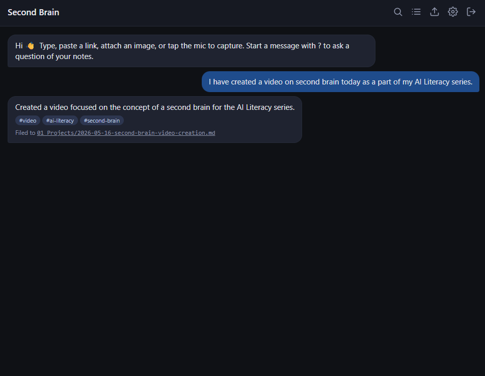
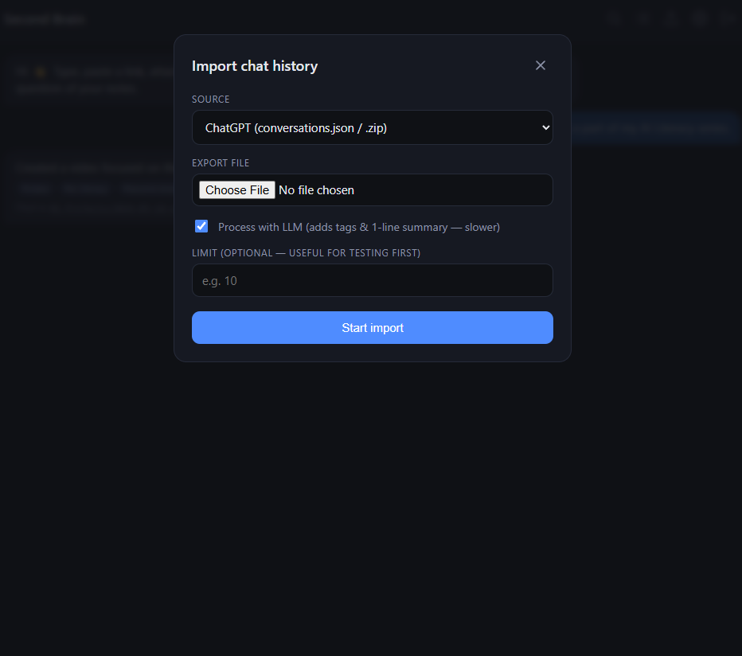
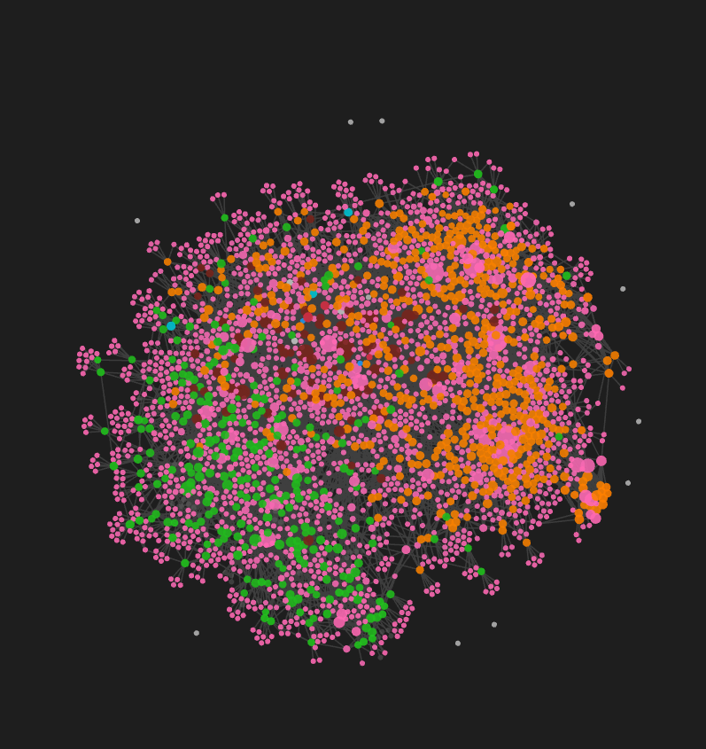

# 🧠 Second Brain

> Capture thoughts like sending a WhatsApp message. AI organises them into your Obsidian vault.

[](./LICENSE)
[](https://www.python.org/downloads/)
[](https://fastapi.tiangolo.com/)

A personal knowledge management system built around two interfaces:

- **A PWA chat app** for capturing — text, voice, images, links — from any device
- **Obsidian** for browsing, connecting, and visualising the graph

Between them, an AI pipeline categorises every capture into a PARA-style folder, generates tags + a one-line summary, transcribes voice, describes images, fetches links, and auto-links related notes so the Obsidian graph view becomes genuinely useful.

---

## Screenshots

> *Placeholders — drop PNGs into `docs/screenshots/` to fill these in.*

| Capture (PWA) | Browse / Search | Obsidian graph |
| :-: | :-: | :-: |
|  |  |  |

---

## Features

- 💬 **WhatsApp-style PWA** — installable on iOS / Android / desktop, dark theme, offline queue
- 🎙️ **Voice notes** — Whisper transcription in one tap
- 📷 **Images** — vision API description + OCR; image embedded in the daily note
- 🔗 **Links** — paste a URL, get a fetched + summarised reference note
- ❓ **Ask** — start a message with `?` to query your vault (semantic search → LLM answer with sources)
- 📂 **Auto-organisation** — every capture is categorised into a PARA folder, tagged, summarised
- 🌤️ **Ambient context** — current weather + reverse-geocoded location attached to daily entries
- 📥 **Import history** — ChatGPT, Claude, and Gemini exports (`.zip` or raw JSON/HTML), with live SSE progress
- 🔍 **Semantic search** — local ChromaDB embeddings; type/source filters
- 🔗 **Auto-linking for the graph** — auto-generated `Tags/` pages, `## Related` sections, daily round-ups
- 🗺️ **MOC builder** — `python cli.py group "topic"` creates a curated Map of Content hub note
- 📵 **Offline queue** — captures while offline; service worker + IndexedDB sync when reconnected
- 🌐 **Public access** — Cloudflare Tunnel quick-start (ephemeral or named)
- 🔌 **Pluggable LLMs** — OpenAI, Anthropic, Google; swap providers + keys from the in-app Settings UI

---

## Quick start

```bash
git clone https://github.com/YOUR_USERNAME/second-brain.git
cd second-brain

# Install (uv recommended; falls back to plain venv)
uv venv && uv pip install -r requirements.txt
# or: python -m venv .venv && .venv/bin/pip install -r requirements.txt

# Configure
cp .env.example .env
# Edit .env. At minimum:
#   OPENAI_API_KEY=...     (required for voice notes — Whisper is OpenAI-only)
#   VAULT_NAME=YourVault   (matches the name shown in Obsidian's vault switcher)

# Run
python run.py
# Open http://localhost:8000 — set a password on first visit
```

Vault folders, ChromaDB, and `.obsidian/graph.json` (with sensible color groups) are created on first launch.

---

## Using the PWA

The composer has four buttons:

| Button | What it does |
| :-: | --- |
| 📎 | Attach an image — vision API describes it, file goes to `08_Attachments/`, note links to it |
| 🎙️ | Tap to start recording, tap again to stop. Whisper transcribes, then the same pipeline files it. |
| ⌨️ | Free-text capture. Auto-categorised into a PARA folder. |
| ➤ | Send (or hit Enter) |

Special inputs:

- `?your question` — semantic search + grounded LLM answer (doesn't save anything)
- A bare URL — fetched + summarised as a reference note

Topbar:

| Icon | Page |
| :-: | --- |
| 🔍 | Semantic search with type / source filters |
| ☰ | Browse recent notes; filter by tag / type / source |
| ⬆ | Import ChatGPT / Claude / Gemini exports (live progress) |
| ⚙ | Settings — switch provider, swap API keys, change models, edit vault name |

Click any path in a result → opens the note in **Obsidian** via `obsidian://open?vault=…&file=…` (configure `VAULT_NAME` in `.env` so the URLs resolve).

### Install as a real app

In Chrome/Edge/Safari: open the URL → "Add to Home Screen" (iOS) / "Install app" (Chrome). You get a standalone window with no browser chrome — feels like a native app.

---

## Importing chat history

### ChatGPT
1. ChatGPT → Settings → Data Controls → Export data
2. Wait for the email, download the ZIP
3. PWA → Import → ChatGPT → drop the ZIP. The progress bar shows live counts.

### Claude
1. Claude → Settings → Account → Export data
2. Drop `claude_chat.zip` (or unzipped `conversations.json`) into Import → Claude

### Gemini
1. Google Takeout → "My Activity" → Gemini Apps Activity (HTML or JSON)
2. Drop the ZIP into Import → Gemini
3. Sidecar folders (`gemini_scheduled_actions_data`, `gemini_gems_data`, `__MACOSX`) are auto-skipped

For large exports, set a small **Limit** first (e.g. 5) to verify everything looks right before processing the whole archive — each conversation is one LLM call for tags + summary.

---

## Architecture

```
┌──────────────────────┐     HTTPS      ┌──────────────────────┐
│   PWA chat (JS)      │◀──────────────▶│   FastAPI backend    │
│  service worker +    │                │   bcrypt auth        │
│  IndexedDB queue     │                │   AI pipeline        │
└──────────────────────┘                └──────────┬───────────┘
                                                   │
        ┌──────────────────────────────────────────┼──────────────────────┐
        │                       │                  │                      │
        ▼                       ▼                  ▼                      ▼
  Obsidian vault           ChromaDB          LLM provider           Open-Meteo
  (.md + frontmatter)      (local, file)     (OpenAI/Anthropic/     + Nominatim
                                              Google — pluggable)   (weather/loc)
```

### Tech stack

- **Backend** — Python 3.11+, FastAPI, uvicorn
- **Vector DB** — ChromaDB (local, file-backed, default `all-MiniLM-L6-v2` embeddings)
- **Frontend** — Vanilla JS PWA (no framework, no build step), service worker, IndexedDB
- **LLMs** — OpenAI (`gpt-4o-mini`), Anthropic (`claude-sonnet-4-…`), Google (`gemini-2.0-flash`) — all pluggable
- **Voice** — OpenAI Whisper API
- **Auth** — bcrypt + in-memory bearer tokens (single-user app)
- **Markdown** — `python-frontmatter`
- **Public access** — Cloudflare Tunnel

---

## CLI

```bash
python cli.py status                 # vault path, configured providers, index size
python cli.py reindex                # rebuild ChromaDB from .md files on disk
python cli.py reindex -v             # ... and log each indexed file
python cli.py link                   # regenerate Tags/ pages + Tags/Related sections in every note
python cli.py group "topic name"     # build a Map of Content hub note for a topic
```

`reindex`, `link`, and `group` are all idempotent and safe to re-run.

### Auto-linking (Obsidian graph)

Every standalone capture ends with two auto-managed sections:

```markdown
<!-- linker:tags -->
## Tags
[[Tags/python|python]] [[Tags/web-scraping|web-scraping]]
<!-- /linker:tags -->

<!-- linker:related -->
## Related
- [[06_Chats/ChatGPT/2024-01-15-web-scraping-help-abc|Web Scraping Help]]
- [[03_Resources/2024-02-20-bs4-tips-def|BeautifulSoup Tips]]
<!-- /linker:related -->
```

Daily notes get an extra `Notes from today` section. The semantic indexer **strips** these markers before chunking, so auto-link content never pollutes search.

`vault/.obsidian/graph.json` is seeded on first launch with color groups by folder (Daily=blue, ChatGPT=green, Claude=purple, Gemini=orange, Projects=red, Areas=yellow, Resources=teal, References=gray, Tags=pink). Existing files are never overwritten.

---

## Configuration

All keys load from `.env` first; the in-app **Settings** overlay can override any of them at runtime (overrides land in `vault/_meta/config.json`, which is gitignored).

| Key | Purpose |
| --- | --- |
| `VAULT_PATH` | Path to the Obsidian vault (default `./vault`) |
| `VAULT_NAME` | Vault name as shown in Obsidian's vault switcher — used to build `obsidian://` URLs |
| `OPENAI_API_KEY` | **Required for voice** (Whisper is OpenAI-only) |
| `ANTHROPIC_API_KEY` | Anthropic / Claude key |
| `GOOGLE_API_KEY` | Google / Gemini key |
| `ACTIVE_PROVIDER` | `openai` / `anthropic` / `google` |
| `OPENAI_MODEL`, `ANTHROPIC_MODEL`, `GOOGLE_MODEL` | Per-provider model name |
| `HOST`, `PORT` | Server bind address |
| `APP_PASSWORD` | Optional — seeds the password hash on first run if no password is set yet |

---

## Public access (Cloudflare Tunnel)

Quick start (ephemeral URL, changes per restart):

```bash
./setup_tunnel.sh        # macOS/Linux
.\setup_tunnel.ps1       # Windows
```

For a stable URL, use a named tunnel:

```bash
cloudflared tunnel login
cloudflared tunnel create second-brain
cloudflared tunnel route dns second-brain brain.example.com
cloudflared tunnel run --url http://localhost:8000 second-brain
```

> Browser geolocation requires HTTPS. Cloudflare Tunnel gives you that. `http://localhost` also works because localhost is treated as a secure origin.

---

## Roadmap

- [ ] Browser history import
- [ ] AI-maintained MOC pages auto-refresh on a schedule
- [ ] Calendar / timeline view
- [ ] Native Obsidian companion plugin
- [ ] Self-hosted LLM support (Ollama)
- [ ] Test suite

See [`SECOND_BRAIN_SPEC.md`](./SECOND_BRAIN_SPEC.md) §15 for details.

---

## Caveats

- The settings overrides file (`vault/_meta/config.json`) is **plain JSON, not encrypted**. Filesystem permissions are the protection.
- Voice capture uses OpenAI Whisper regardless of the active text-completion provider.
- Open-Meteo has no reverse geocoding — location names come from OpenStreetMap Nominatim (free, no key, ~1 req/sec policy; the 15-min cache stays well under).
- Auto-linking on a fresh capture is fast; on a vault with thousands of notes it walks the disk once per capture (cached 30 s afterwards).
- The vector index excludes `_meta/`, `Templates/`, and `Tags/`; browse includes `Tags/` so you can navigate to tag pages.

---

## Contributing

PRs welcome. See [CONTRIBUTING.md](./CONTRIBUTING.md) for setup and guidelines.

## License

[MIT](./LICENSE) — do whatever you want with it. Attribution appreciated.
